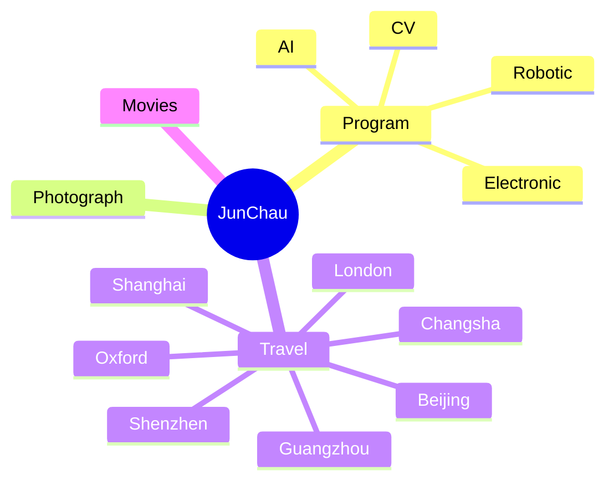

## Hi there 👋
### I'm Jun Chau, White Mo

💪 Learning \

![Metrics](https://metrics.lecoq.io/WhiteMoZJ?template=classic&base.indepth=true&languages=1&lines=1&stars=1&habits=1&followup=1&fortune=1&introduction=1&base=header%2C%20activity%2C%20community%2C%20repositories%2C%20metadata&base.indepth=true&base.hireable=false&base.skip=false&languages=false&languages.limit=8&languages.threshold=0%25&languages.other=true&languages.colors=github&languages.sections=most-used&languages.indepth=false&languages.analysis.timeout=15&languages.analysis.timeout.repositories=7.5&languages.categories=markup%2C%20programming&languages.recent.categories=markup%2C%20programming&languages.recent.load=300&languages.recent.days=14&lines=false&lines.sections=base&lines.repositories.limit=4&lines.history.limit=1&lines.delay=0&stars=false&stars.limit=4&habits=false&habits.from=200&habits.days=14&habits.facts=true&habits.charts=false&habits.charts.type=classic&habits.trim=false&habits.languages.limit=8&habits.languages.threshold=0%25&followup=false&followup.sections=repositories&followup.indepth=false&followup.archived=true&introduction=false&introduction.title=true&fortune=false&config.timezone=Asia%2FShanghai&config.octicon=true)

