## Hi there 👋
### I'm Jun Chau, White Mo

[](https://github.com/WhiteMoZJ/github-readme-activity-graph)
<div align="center">
  <div align="center">
      <a href="https://space.bilibili.com/39763770"></a>&emsp;
  </div>
  
  💪 Learning \
  
  
  
  
</div>

<table align="center">
  <td align="center">
    </img>
  </td>
</table>
  
  ```mermaid
  mindmap
    root((JunChau))
      Program
        CV
        AI
        Robotic
        Electronic
      Photograph
      Travel
        Guangzhou
        Shenzhen
        Changsha
        Beijing
        Shanghai
        London
        Oxford
      Movies
        Science Fiction
        History
        
  ```

